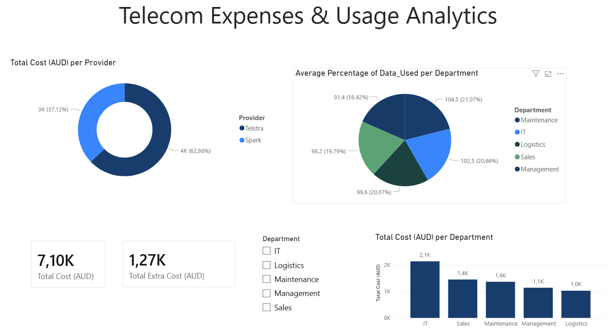

# IT & Infrastructure Manager (V.I.E - Reference: VIE235687)
## Safran Helicopter Engines Australia
**Candidate:** Mathieu LAM  

This repository showcases my ability to deliver the key missions described in the SHE Australia V.I.E offer: **Power BI reporting**, **.NET application migration to AWS**, and **knowledge of emerging technologies**.

---

## Project 1: Telecom Expense Management (Power BI)

*Direct response to: "Génération de rapports Power BI (factures Telstra et Spark)"*

- **Objective:** Design an interactive dashboard to monitor costs and identify budget leaks.
- **AI Integration:** Use of **ChatGPT** to generate a realistic dataset on complex employee billing.
- **Key KPIs:**
  - Total cost and total extra cost
  - Departmental usage analysis (Maintenance, IT, Logistics, Sales, Management).
  - Comparative analysis between **Telstra** and **Spark**.
- **Files included:** `Dashboard_Telecom.pbix`, `facturation_mobile_telstra_spark_safran.csv`.

---

## Project 2: Equipment Tracker Deployment (AWS & .NET)
*Direct response to: "Migration d'applications .NET sur AWS"*

- **Objective:** Development and cloud deployment of a centralized IT asset management tool.
- **Tech Stack:** ASP.NET Core MVC (C#), Bootstrap, AWS IAM.
- **Cloud Infrastructure:** Fully deployed on **AWS Elastic Beanstalk** (Linux environment).
- **[Project Link](http://myfirstproject-dev.eba-wtkqejnu.eu-west-3.elasticbeanstalk.com/)**
- **Folder included** 'MyFirstWebProject'

---

## 🛠️ Technical Skills Demonstrated
- **Data & BI:** Power BI, Power Query, SQL.
- **Cloud & Dev:** AWS (Elastic Beanstalk, IAM), C#, .NET.
- **IA:** ChatGPT.
